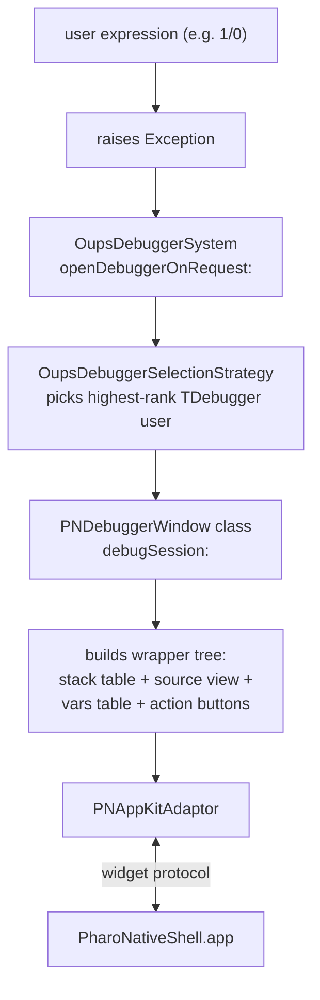

## Architecture



No widget protocol additions. No native shell changes. The entire feature lives in one new Pharo class.

## Pharo's existing debugger contract

`[TDebugger.trait.st](pharo/src/Debugger-Model/TDebugger.trait.st)` defines the four hooks every debugger implements on its class side:

- `debugSession: aDebugSession` -- entry point. Open the UI; the caller will then `aDebugRequest process suspend` to actually pause the debugged process.
- `closeAllDebuggers` -- called by `[OupsDebuggerSystem.class.st](pharo/src/Debugger-Oups/OupsDebuggerSystem.class.st)>>closeAllDebuggers` to shut everything down.
- `handlesDebugSession: aDebugSession` -- gate. Default checks `SmalltalkImage current isInteractive`; we will override to return `true` unconditionally so we work in any image mode.
- `rank` -- bigger number wins. We will pick something higher than the in-image default (the default debugger uses ~`DebuggerSettings defaultDebuggerRank`).

`[DebugSession.class.st](pharo/src/Debugger-Model/DebugSession.class.st)` gives us everything we need to render and to act:

- `stack` -- an OrderedCollection of `Context`s, top frame first.
- `interruptedContext` -- the context where execution paused.
- `exception` -- the Exception instance (or an `OupsNullException` placeholder).
- `stepOver / stepOver:`, `stepInto / stepInto:`, `stepThrough / stepThrough:`, `restart:`, `resume`, `terminate`.
- `isContextPostMortem:` -- for sessions without a live process (e.g. logged crashes).

`[Context.class.st](pharo/src/Kernel-CodeModel/Context.class.st)` exposes `receiver`, `selector`, `method`, `sourceCode`, `pc`, `tempNames`, `tempAt:`, and `printOn:` -- everything we need for the stack line and the variables list.

## New class: PNDebuggerWindow

File: `pharo-bridge/src/PharoNative-AppKit-Tools/PNDebuggerWindow.class.st`.

```
Class {
    #name : 'PNDebuggerWindow',
    #superclass : 'Object',
    #traits : 'TDebugger',
    #classTraits : 'TDebugger classTrait',
    #instVars : [
        'session', 'window', 'outerSplit', 'middleSplit',
        'stackScroll', 'stackTable',
        'sourceScroll', 'sourceTextView',
        'varsScroll', 'varsTable',
        'buttonRow', 'proceedButton', 'restartButton', 'stepOverButton', 'abandonButton',
        'currentStack', 'selectedFrameIndex'
    ],
    ...
}
```

### Class side -- TDebugger contract

- `rank` returns 1000 (well above the default).
- `availableAutomatically` returns true.
- `handlesDebugSession: aSession` returns true.
- `closeAllDebuggers` walks `self allInstances` and sends `#destroyAll` to each, swallowing per-instance errors.
- `debugSession: aSession` creates an instance, calls `#openOn:` with the session, returns immediately so Oups can suspend the debugged process.

### Instance side -- building

- `openOn: aSession`
  1. store session
  2. build window (1100x780): outer vertical split = top half stack list + middle source + bottom variables + button row; for layout we use an outer NSSplitView, with the stack list and source as the top split and the variables+buttons as the bottom split.
  3. wire selection: clicking a stack row repopulates source + vars
  4. wire each action button to its DebugSession method
  5. populate from session
  6. `window show`
- Layout shape using existing wrappers:

```
window
  outerSplit (vertical, non-vertical orientation)
    topSplit (horizontal-divider sub-split)
      stackScroll -> stackTable     (left, ~40% width)
      sourceScroll -> sourceTextView  (right, ~60% width)
    bottomBox (PNNSView)
      varsScroll -> varsTable       (top of bottom)
      buttonRow (PNNSView)           (bottom strip, 40 tall)
        proceedButton + restartButton + stepOverButton + abandonButton (frame'd in row)
```

We will reuse the autoresizingMask plumbing we added for the System Browser so the panes grow with the window.

### Refresh cycle

`refresh`:
- `currentStack := session stack`
- stackTable rows: `currentStack collect: [ :ctx | { self frameLabelFor: ctx } ]`
- preserve `selectedFrameIndex` if still valid, otherwise set to 0 and select row 0 (which triggers source + vars repopulation).
- `window title:` set to a short label including exception class + message, e.g. `Debugger: ZeroDivide -- 1/0`.

`frameLabelFor: aContext` returns `receiver class name , '>>' , aContext selector asString` (truncated to a sane length).

`displaySourceFor: aContext`:
- `sourceTextView string: (aContext sourceCode ifNil: [ '"no source"' ])`.
- v1 does not highlight the PC line; we can add this later via `attributedRuns`.

`displayVarsFor: aContext`:
- Build rows:
  - `{ 'self'. aContext receiver printString }`
  - for each `name` in `aContext tempNames` from index 1, `{ name. (aContext tempAt: i) printString }`.
- `varsTable rows: rows`.

### Actions

- `actProceed`: `[ session resume ] on: Error do: [ :ignored | ]`. Then `self destroyAll`.
- `actRestart`: `session restart: (currentStack at: selectedFrameIndex + 1)`. Then `self refresh`.
- `actStepOver`: `session stepOver: (currentStack at: selectedFrameIndex + 1)`. Then `self refresh`.
- `actAbandon`: `[ session terminate ] on: Error do: [ :ignored | ]`. Then `self destroyAll`.

We do not need Step Into in v1; it follows the same pattern when we add it.

### Lifecycle

- `window onWillClose: [ self destroyAll ]` so closing the window via the title-bar widget tears down all wrappers and (optionally) terminates the session.
- `destroyAll` walks the instance vars in destruction-safe order, calling `destroy` on each widget and swallowing errors per-widget.

### Baseline

Already wired: `PNDebuggerWindow` lands in `PharoNative-AppKit-Tools`, which is already in `[BaselineOfPharoNativeBridge.class.st](pharo-bridge/src/BaselineOfPharoNativeBridge/BaselineOfPharoNativeBridge.class.st)`. Re-running `install.sh` picks it up.

## v1 smoke test

After `pharo-bridge/scripts/install.sh`:

1. Launch the bootstrapped image with GUI.
2. In a Playground, evaluate `1/0`. (Or, headlessly: `PNDebuggerWindow debugSession: OupsDummyDebugger dummySession`.)
3. A native debugger window opens, titled "Debugger: ZeroDivide -- ..." with the stack populated.
4. Selecting different frames updates the source view and the variables list.
5. Clicking "Step Over" advances execution; the stack updates accordingly.
6. Clicking "Abandon" terminates the suspended process and closes the window.
7. Clicking "Proceed" resumes the process and closes the window.

## What v1 explicitly defers

- Current-PC line highlighting in the source pane. Easy add via `attributedRuns` once we know the byte range of `aContext pc` in `sourceCode`.
- Step Into / Step Through. Same pattern as Step Over; one-line additions.
- Inspector window (separate from the variables list; full object graph navigation). Becomes its own plan after the debugger lands.
- Editable source in the source view. The Morphic debugger lets you fix and proceed; we need the `editable: true` + `onCommit:` flow first (planned as a follow-up to the Method-editing item).
- Post-mortem sessions (frozen exceptions without a live process). The TDebugger contract still calls us; the action buttons need conditional disabling. Out of scope for v1.