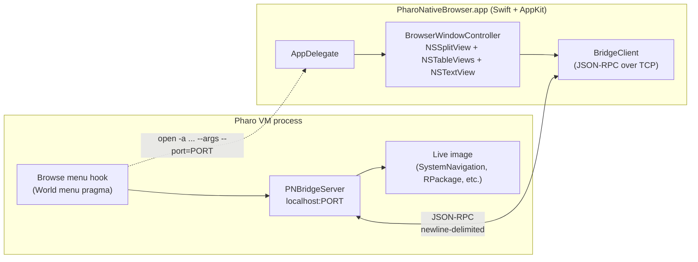

## Architecture

User flow for v1: Browse menu item -> Pharo ensures bridge is listening on a free port -> Pharo execs `open -a .../PharoNativeBrowser.app --args --port=N` -> native app opens an NSWindow with a 4-pane browser (Packages | Classes | Protocols | Methods) and a source viewer pane, populated by RPC calls. No editing in v1; source view is read-only.

## Repo layout (new)

- `pharo-bridge/` -- Pharo-side Tonel source for the new packages, loadable into a running image via filetree, eventually committed into `pharo/src/` for bootstrap-time inclusion.
  - `pharo-bridge/src/PharoNative-Bridge-Core/` (server, protocol, JSON codec)
  - `pharo-bridge/src/PharoNative-Bridge-MenuHook/` (World menu integration)
  - `pharo-bridge/scripts/install.st` -- one-liner to load both packages into the running image via `Metacello new ... filetree://...`
- `pharo-native-browser/` -- Swift/AppKit app.
  - `pharo-native-browser/PharoNativeBrowser.xcodeproj`
  - `pharo-native-browser/PharoNativeBrowser/AppDelegate.swift`
  - `pharo-native-browser/PharoNativeBrowser/Bridge/BridgeClient.swift`
  - `pharo-native-browser/PharoNativeBrowser/Bridge/JSONRPC.swift`
  - `pharo-native-browser/PharoNativeBrowser/UI/BrowserWindowController.swift`
  - `pharo-native-browser/PharoNativeBrowser/UI/BrowserViewController.swift`
  - `pharo-native-browser/PharoNativeBrowser/UI/SmalltalkSyntaxHighlighter.swift`
  - `pharo-native-browser/scripts/build.sh` -- wraps `xcodebuild -configuration Release`, outputs `pharo-native-browser/build/PharoNativeBrowser.app`.

## Wire protocol (v1)

Newline-delimited JSON-RPC 2.0 over a single TCP connection (one connection per native window). Methods, all read-only:

- `system.listPackages()` -> `[{name, classCount}]`
- `package.listClasses(package)` -> `[{name, side: "instance"|"class", superclass}]`
- `class.listProtocols(class, side)` -> `[{name, methodCount}]`
- `protocol.listMethods(class, side, protocol)` -> `[selector]`
- `method.getSource(class, side, selector)` -> `{source, category, author, timestamp}`

Implemented in Pharo via `SystemNavigation`, `RPackageOrganizer`, and `CompiledMethod` APIs already used by Calypso (e.g. `RPackage>>definedClasses`, `Class>>organization>>protocols`, `Class>>sourceCodeAt:`). All requests are dispatched on a background `Process` so the UI process loop stays unaffected.

## Pharo-side details

- `PNBridgeServer` (in `PharoNative-Bridge-Core`):
  - class-side singleton; `PNBridgeServer ensureRunning` opens a `Socket` on a free port (port number captured in a class var), forks a listener process, accepts one or more connections, reads JSON requests delimited by `\n`, dispatches to handler methods, writes JSON responses.
  - JSON via `NeoJSONReader`/`NeoJSONWriter` (already in the image; baselined under `OS-NeoJSON` / `Neo-JSON-Core` in `pharo/src/`).
  - Each handler is a method on `PNBridgeHandlers` to keep request dispatch flat and testable.
- `PharoNative-Bridge-MenuHook`:
  - Adds a `PNWorldMenu class>>browseMenuOn:` with `<worldMenu>` pragma that inserts a `Native System Browser` item under the existing Browse menu (alongside Calypso, not replacing it in v1).
  - Selector ensures server is up, computes `--port=N`, runs `LibC uniqueInstance system: ('open -a ', appPath quoted, ' --args --port=', port asString)`.
  - App path is settable via a `PNSettings` entry (default: `<image dir>/../../pharo-native-browser/build/PharoNativeBrowser.app`).
- Installation into the already-built image (`pharo/build/bootstrap-cache/Pharo14.0-SNAPSHOT-64bit-4ba0b8f40b.image`):
  - Run once: `Pharo Pharo.image st pharo-bridge/scripts/install.st --save --quit` which Metacello-loads the two packages from `filetree://pharo-bridge/src` then saves the image.

## Native app details

- Single-window v1, 4 stacked `NSTableView`s in an `NSSplitView` (horizontal) with an `NSTextView` source pane below in a vertical `NSSplitView` -- matches the layout in the user's screenshot but using true AppKit controls.
- `BridgeClient` is an `actor`-style class using `Network.framework` (`NWConnection`) for the TCP socket; requests return `async throws` via Swift concurrency, results dispatched to `@MainActor` for UI updates.
- `SmalltalkSyntaxHighlighter` does a minimal first pass: keywords (`self`, `super`, `true`, `false`, `nil`, `thisContext`), comments (`"..."`), string literals (`'...'`), symbol literals (`#...`), selector parts -- enough to look decent; full parsing comes later.
- Read-only `NSTextView` in v1 (`isEditable = false`); we keep the model in place so the future write path is just a new `method.setSource` RPC plus an editable toggle.
- Quitting: app stays open until user closes the window; closing disconnects the socket but does not affect the Pharo image. Multiple browser windows allowed (just open the menu item again).

## Build / run

1. Build native app: `pharo-native-browser/scripts/build.sh` produces `pharo-native-browser/build/PharoNativeBrowser.app`.
2. Install bridge into image (one-time): script `pharo-bridge/scripts/install.sh` wrapping a call to the existing built VM with `st pharo-bridge/scripts/install.st --save --quit` against `pharo/build/bootstrap-cache/Pharo.image`.
3. Launch image as usual via `open -a /Users/phil/local/src/ph/pharo-vm/build/build/vm/Debug/Pharo.app` and picking the saved image; then Browse -> Native System Browser opens the native window.

## What v1 explicitly defers (and how it's set up to grow)

- Method editing -- adds `method.setSource` RPC + flip the NSTextView to editable + a save button; no architectural change.
- Class create/rename / refactorings -- new `class.*` RPCs.
- Debugger window -- new `debugger.*` namespace + `DebuggerWindowController`; Pharo side hooks into `Debugger openOn:` to publish events to subscribed clients instead of opening a Morphic debugger.
- Inspector, Playground, Transcript -- same pattern, each gets its own window controller and RPC namespace.
- Replacing Morphic entirely -- once enough windows are native, add a setting to suppress Morphic windows and run the image effectively headless except for the bridge.