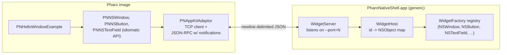

## Architecture (additive, lives alongside v1 fat-client browser)



Direction reversal vs. v1: Pharo opens `PharoNativeShell.app` via `LibC system:` (passing a chosen free port), shell listens on `127.0.0.1:PORT`, Pharo connects as a TCP client. After the connection is established, Pharo drives the UI by sending widget commands; the shell pushes events back over the same socket as JSON-RPC notifications (no `id`, no response expected).

The existing v1 stack ([PNBridgeServer.class.st](pharo-bridge/src/PharoNative-Bridge-Core/PNBridgeServer.class.st), [PharoNativeBrowser.app](pharo-native-browser/build/PharoNativeBrowser.app)) is untouched and keeps working as a reference implementation; the widget-protocol stack ships in parallel folders.

## Wire protocol (v1 widget verbs)

Five request methods (Pharo -> shell), one event direction (shell -> Pharo). All ids are strings allocated by Pharo, prefixed with `w-`.

- `widget.create({ id, type, props })` -> `{ ok: true }`. Instantiate widget class via factory; widget joins the host's registry under `id`. `type` is one of the registered factory names (`NSWindow`, `NSButton`, `NSTextField` in v1). `props` is applied with the same setter logic as `setProp`.
- `widget.setProp({ id, name, value })` -> `{ ok: true }`. Property setter is per-type; e.g. NSWindow handles `title`, `contentSize`. NSButton handles `title`. NSTextField handles `stringValue`, `editable`, `bordered`. All handle `frame: { x, y, w, h }`.
- `widget.addChild({ parentId, childId, role })` -> `{ ok: true }`. `role = "contentView" | "subview"`. NSWindow accepts `contentView`. NSView accepts `subview`.
- `widget.invoke({ id, selector, args })` -> `{ result: ... }`. v1 only needs `NSWindow.makeKeyAndOrderFront:` (selector ignored, args ignored) and `NSWindow.close`.
- `widget.subscribe({ id, event })` -> `{ ok: true }`. Wires the named event source. NSButton supports `clicked`. NSWindow supports `willClose`. (Future: NSTableView `selectionChanged`, NSTextView `textChanged`.)
- `widget.destroy({ id })` -> `{ ok: true }`. Removes from registry and tears down.

Notifications (shell -> Pharo, no `id` field, must not be confused with responses):

- `{ "jsonrpc": "2.0", "method": "event", "params": { "id": "w-3", "event": "clicked", "payload": {} } }`

Adaptor on the Pharo side reads each incoming line and routes by shape: presence of `id` -> response, presence of `method` -> notification.

## Native shell -- new app `pharo-native-shell/`

Same build pattern as `pharo-native-browser/`: `swiftc` + manual `.app` bundle. Files:

- `pharo-native-shell/Sources/PharoNativeShell/main.swift` -- parse `--port=N`, start NSApplication.
- `pharo-native-shell/Sources/PharoNativeShell/AppDelegate.swift` -- on launch, spawn `WidgetServer`, install a small "PharoNativeShell" menu bar (Quit, About) so the app feels native; does NOT open any window of its own.
- `pharo-native-shell/Sources/PharoNativeShell/Server/WidgetServer.swift` -- `Network.framework`-based TCP listener on `127.0.0.1:PORT`, one connection at a time; reads newline-delimited JSON lines, hands each to `WidgetHost`, writes responses + notifications back. All AppKit calls hop to `@MainActor`.
- `pharo-native-shell/Sources/PharoNativeShell/Server/JSONRPC.swift` -- shared codecs (mirrors `pharo-native-browser`'s but with notification support).
- `pharo-native-shell/Sources/PharoNativeShell/Widget/WidgetHost.swift` -- `[String: AnyObject]` registry, command dispatcher.
- `pharo-native-shell/Sources/PharoNativeShell/Widget/WidgetFactory.swift` -- protocol + registry.
- `pharo-native-shell/Sources/PharoNativeShell/Widget/Factories/WindowFactory.swift`, `ButtonFactory.swift`, `TextFieldFactory.swift` -- three v1 factories. Each declares the type name, knows how to instantiate, applies known props, wires known events to emit `event` notifications via a weak ref to the server.
- `pharo-native-shell/scripts/build.sh` -- mirror of `pharo-native-browser/scripts/build.sh`, output at `pharo-native-shell/build/PharoNativeShell.app`.

## Pharo-side packages -- new `pharo-bridge/src/`

Three new packages added to the existing baseline so a single `install.sh` run picks them up:

- `PharoNative-AppKit-Adaptor` -- one class `PNAppKitAdaptor` (singleton). Responsibilities: spawn the shell on first use via `LibC system: 'open -a ...PharoNativeShell.app --args --port=N'` after choosing a free port (bind a Socket, read `localPort`, close, hand the number to the shell, then connect with retry/backoff). Manages the TCP socket, request/response correlation by integer id, notification dispatch table keyed by `widget id -> { event -> block }`. Provides `call: method params: aDict`, `notify: method params: aDict`, `onEvent: aWidgetId named: aSymbol do: aBlock`.
- `PharoNative-AppKit-Widgets` -- wrapper classes:
  - `PNAppKitWidget` (abstract): holds `id`, weak ref to adaptor; `create: typeName props: aDict`, `setProp: name value: anObject`, `destroy`.
  - `PNNSWindow` subclass: `title:`, `contentSize:`, `contentView:`, `show` (which `invoke`s `makeKeyAndOrderFront:`), `onWillClose:` (subscribes + registers block).
  - `PNNSView` subclass (used as content view for v1): `addSubview:`, `frame:`.
  - `PNNSButton` subclass: `title:`, `frame:`, `onClicked:`.
  - `PNNSTextField` subclass: `stringValue:`, `stringValue`, `editable:`, `frame:`.
- `PharoNative-AppKit-Examples` -- one class `PNHelloWindowExample` with class-side `open`:

  ```smalltalk
  | win label button |
  win := PNNSWindow new title: 'Hello from Pharo'; contentSize: 320 @ 160; yourself.
  label := PNNSTextField new
      stringValue: 'click the button';
      editable: false;
      bordered: false;
      frame: (10 @ 80 extent: 300 @ 24);
      yourself.
  button := PNNSButton new
      title: 'Press me';
      frame: (110 @ 30 extent: 100 @ 32);
      onClicked: [ label stringValue: 'clicked at ', DateAndTime now asString ];
      yourself.
  win contentView addSubview: label; addSubview: button.
  win show.
  ```

Add `BaselineOfPharoNativeBridge` entries for the three new packages so `pharo-bridge/scripts/install.sh` continues to be the one-button installer. Update [BaselineOfPharoNativeBridge.class.st](pharo-bridge/src/BaselineOfPharoNativeBridge/BaselineOfPharoNativeBridge.class.st) accordingly.

## v1 smoke test

After `pharo-native-shell/scripts/build.sh` + `pharo-bridge/scripts/install.sh`:

1. Launch the image with GUI as before.
2. In a Playground: `PNHelloWindowExample open`.
3. A native NSWindow titled "Hello from Pharo" appears with a label and a button.
4. Clicking the button causes the label to update to `clicked at ...` -- proves the full round-trip (Pharo -> create/setProp/addChild -> shell renders; click -> shell -> event notification -> Pharo block -> setProp -> shell updates label).
5. Closing the window cleanly tears down widgets on both sides (via `willClose` -> Pharo destroys window).

When that works, the architecture is validated and porting the System Browser to use the wrappers is a straightforward follow-on (a separate plan).

## Out of scope for this plan

- Porting the System Browser itself to the new protocol. Tracked as a follow-up after smoke test passes.
- NSTableView / NSOutlineView / NSTextView wrappers (they need batched row APIs to be performant; warrants its own design).
- Constraints-based layout. v1 uses simple frame rects; AutoLayout comes later.
- Menus, toolbars, modal alerts, drag-and-drop, focus rings, accessibility -- each gets its own iteration.
- Replacing or hiding the existing v1 fat-client browser. It stays as a reference.