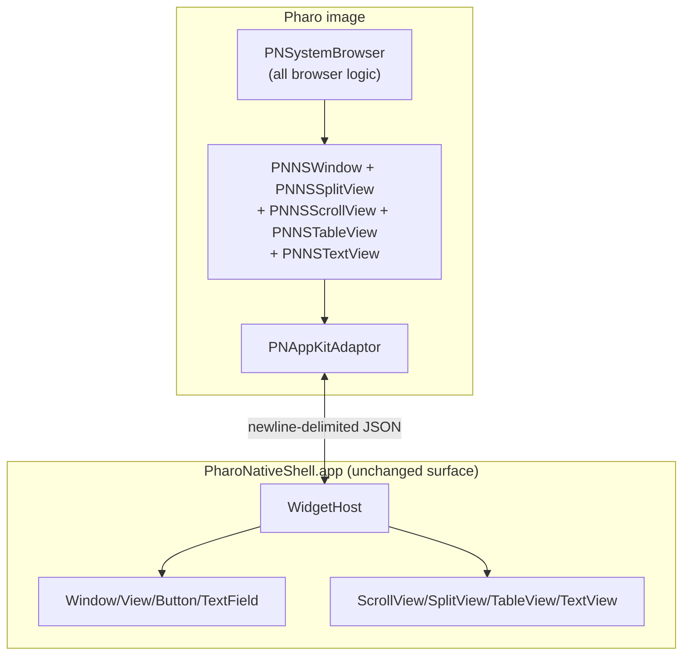

## Architecture

The widget protocol stays exactly as designed; we just register four more factories on the shell and four more wrappers in Pharo. The System Browser is a new Pharo class that wires them together.

User flow once shipped:
1. World menu -> "Native System Browser (Pharo-driven)".
2. `PNToolsMenu` evaluates `PNSystemBrowser open`.
3. `PNSystemBrowser` creates the wrapper tree, populates packages from `PackageOrganizer default`, and shows the window.
4. Each table selection invokes a Pharo block which queries the image and calls `rows:` on the next table or `string:` on the text view.

## Wire protocol additions

New types: `NSScrollView`, `NSSplitView`, `NSTableView`, `NSTextView`.

New child roles:
- `documentView` -- `NSScrollView` accepts exactly one. The shell binds the child as `scrollView.documentView`.
- `arrangedSubview` -- `NSSplitView` accepts many; preserves insertion order.

New properties (per type):
- `NSScrollView`: `hasVerticalScroller` (bool), `hasHorizontalScroller` (bool), `borderType` (`"none" | "line" | "bezel" | "groove"`), `frame`.
- `NSSplitView`: `vertical` (bool; default false = vertical divider with horizontally-arranged children, matching AppKit), `dividerStyle` (`"thin" | "thick" | "paneSplitter"`), `dividerPositions` (`[Number]`), `frame`.
- `NSTableView`: `columns` (`[{"title": String, "identifier": String, "width": Number?}]` -- replace), `rows` (`[[String]]` parallel to columns -- bulk replace + reloadData), `selectedRow` (Number -- programmatic selection, `-1` clears), `usesAlternatingRowBackgroundColors` (bool), `frame`.
- `NSTextView`: `string` (String -- replace contents), `attributedRuns` (`[{"location": Int, "length": Int, "foreground": "green"|"red"|"blue"|...}]` -- optional styling, applied after `string`), `editable` (bool, false in v2), `font` (`{family: String, size: Number}`), `frame`.

New events:
- `NSTableView` `selectionChanged` -> `{ "row": Number }` (-1 when nothing selected).

`widget.invoke` additions: none required for v2.

## Native shell -- new files

All under [pharo-native-shell/Sources/PharoNativeShell/Widget/Factories/](pharo-native-shell/Sources/PharoNativeShell/Widget/Factories):

- `ScrollViewFactory.swift` -- creates `NSScrollView` with sensible defaults; child role `documentView` sets `scrollView.documentView` and, when the document is an `NSTableView`, also configures `tv.frame = scrollView.contentSize` and `tv.autoresizingMask = [.width]`.
- `SplitViewFactory.swift` -- creates `NSSplitView`; `vertical` true means horizontal stack; `addArrangedSubview` on each child. `dividerPositions` applied via `setPosition(_:ofDividerAt:)` after the next layout pass (use `DispatchQueue.main.async`).
- `TableViewFactory.swift` -- the big one. Creates an `NSTableView`. Hosts a small `TableModel` `NSObject` subclass that conforms to `NSTableViewDataSource` + `NSTableViewDelegate`. `columns` replaces `tableView.tableColumns` with `NSTableColumn`s identified by the provided identifier. `rows` swaps a `[[String]]` model and calls `reloadData()`. `selectedRow` calls `selectRowIndexes:byExtendingSelection:`. `selectionChanged` subscribes via `tableViewSelectionDidChange:` and emits `{row}`. Cells use simple `NSTextField`-style view via `makeView(withIdentifier:)`.
- `TextViewFactory.swift` -- creates an `NSTextView` configured for code display (monospaced font, no rich text, no automatic substitutions, disabled by default). `string` writes through `textStorage.mutableString`. `attributedRuns` walks the array, applying `NSColor`s for the listed runs over the current text storage. `editable=false` in v2.

Update [WidgetHost.swift](pharo-native-shell/Sources/PharoNativeShell/Widget/WidgetHost.swift) `registerDefaults` to include the four new factories.

## Pharo wrappers -- additions to `PharoNative-AppKit-Widgets`

All under [pharo-bridge/src/PharoNative-AppKit-Widgets/](pharo-bridge/src/PharoNative-AppKit-Widgets):

- `PNNSScrollView` (`widgetTypeName: 'NSScrollView'`) -- `documentView: aWidget` sends `addChild:role: 'documentView'`. Plus `hasVerticalScroller:`, `hasHorizontalScroller:`, `borderType:`.
- `PNNSSplitView` (`'NSSplitView'`) -- `vertical:`, `addArrangedSubview:`, `dividerPositions:` (takes a Smalltalk array of Numbers and ships it as an Array).
- `PNNSTableView` (`'NSTableView'`) -- `columns: anArrayOfDictionaries`, `rows: anArrayOfArrays`, `selectedRow:`, `onSelectionChanged: aBlock` (block receives the row index as an integer; -1 means deselect).
- `PNNSTextView` (`'NSTextView'`) -- `string:`, `attributedRuns:`, `editable:`. Stays read-only in v2.

## New package `PharoNative-AppKit-Tools`

- `pharo-bridge/src/PharoNative-AppKit-Tools/package.st`
- `PNSystemBrowser.class.st` -- holds wrapper instance vars (`window`, `outerSplit`, `topSplit`, `packagesTable`, `classesTable`, `protocolsTable`, `methodsTable`, `sourceTextView`, `packages`, `classes`, `protocols`, `methods`). Class-side `open` constructs and returns an instance. The build method:
  1. Builds an outer vertical `PNNSSplitView`; top half = horizontal `PNNSSplitView`, bottom half = scrolled `PNNSTextView`.
  2. Inside the horizontal split, four scrolled `PNNSTableView`s with single columns titled Packages / Classes / Protocols / Methods.
  3. Wires `onSelectionChanged:` blocks for each table that re-query the image and re-populate the next column down the chain.
  4. Initial `populatePackages` reads `PackageOrganizer default packages` (already used in [PNBridgeHandlers.class.st](pharo-bridge/src/PharoNative-Bridge-Core/PNBridgeHandlers.class.st)).
  5. `onWillClose:` on the window calls `destroyAll` which destroys every wrapper.
- `PNToolsMenu.class.st` -- world menu pragma adds "Native System Browser (Pharo-driven)" under `#Browsing` with order: 2 (sits below the v1 entry at order 1 so both are visible during the migration).

Add the new package to [BaselineOfPharoNativeBridge.class.st](pharo-bridge/src/BaselineOfPharoNativeBridge/BaselineOfPharoNativeBridge.class.st) so [install.sh](pharo-bridge/scripts/install.sh) picks it up.

## v2 smoke test

After `pharo-native-shell/scripts/build.sh` + `pharo-bridge/scripts/install.sh`:

1. Launch the bootstrapped image with GUI.
2. World menu -> Browse -> "Native System Browser (Pharo-driven)".
3. A native window opens with the same four-pane layout as the v1 fat-client browser.
4. Clicking a package populates classes; clicking a class populates protocols (and seeds methods with no-protocol-filter); clicking a protocol filters methods; clicking a method shows source in the bottom pane.
5. Resizing the window and dragging dividers behaves natively.
6. Closing the window destroys all wrappers (verified by `PNSystemBrowser allInstances` returning empty after a GC, or by checking that the shell registry is empty -- could add `shell.ping` style introspection later).

If step 4 works end to end, the architecture proves itself a second time on a non-trivial UI.

## Out of scope for this plan

- Syntax highlighting in the new browser. v2 ships plain text in the source pane; we can reintroduce the Swift highlighter or write a Pharo equivalent emitting `attributedRuns` as a follow-up.
- Editing methods. Source view stays read-only; the v1 fat-client browser was also read-only.
- Lazy / streaming row delivery on NSTableView (bulk-replace `rows` is good for System Browser sizes; revisit if we see jank).
- Replacing or removing the v1 fat-client browser. It stays in the image; the menu has both entries.
- Native Debugger / Inspector / Playground -- each becomes its own plan after the System Browser proves the pattern.